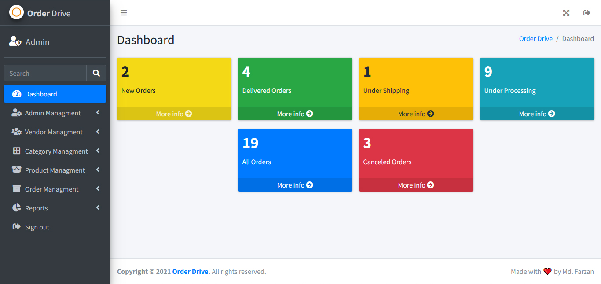

# Order Drive
An B2B Vendor Order Management System built for my BCA Final semester project.  
In this, vendor places an order and admin process their order on different stages.

## A Glance

## Built Using

### Core Languages
HTML5, CSS3, Javascript, PHP, SQL.

### Templates
CodeIgniter 4 AppStarter Template, 
AdminLTE Dashboard

### Database
MySQL

### Frameworks
Bootstrap,  
CodeIgniter 4

### Libraries
jQuery

### Icon Libraries
FontAwesome

### Plugins
DataTable, 
Select 2, 
CKEditor

### Package Manager
Composer

### License
This project is unlicensed. Please see LICENSE.

